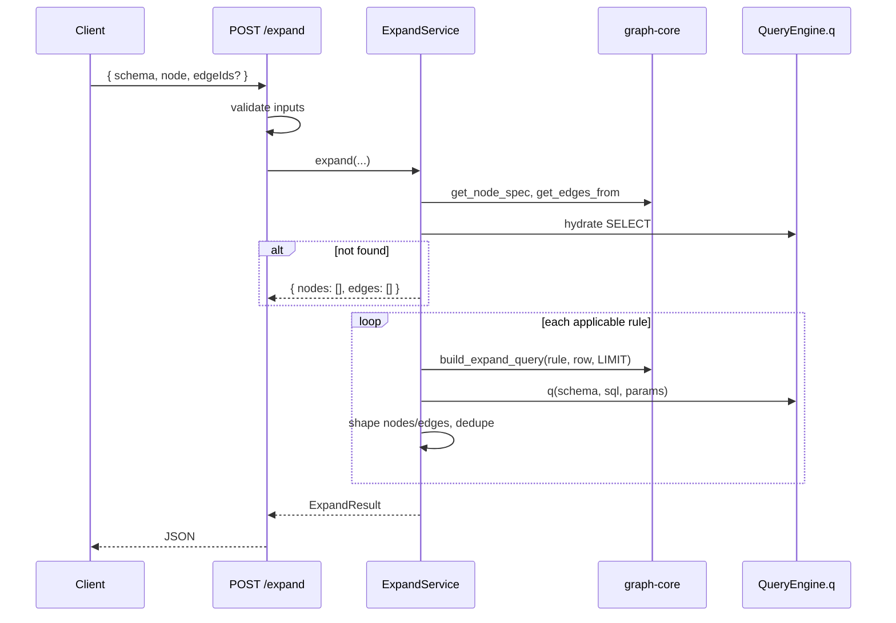

## Context

graph-core（`codegraph_core/graph/`）已提供 NodeSpec、EDGE_RULES、`build_expand_query()`。前端图探索需要「给定一个节点，沿 forward 边展开一层邻居」的统一 API，而不是为每种关系维护专用 GET 端点。

当前 `codegraph_server/routes.py` 有大量资源型端点（`get_flow`、`resolve_chain` 等），内含手写 SQL 与 ER 知识重复。本 change 新增 **POST `/api/v1/expand`** 作为 declarative 展开入口，编排层调用 graph-core，不修改内核注册表。

技术栈：Python 3、FastAPI、`codegraph_core.QueryEngine.q()`、PyMySQL 参数绑定。

## Goals / Non-Goals

**Goals:**

- POST `/api/v1/expand`：输入 `{ schema, node: { type, id }, edgeIds? }`，输出 `{ nodes, edges }`
- 起点水合：按 id 查起点表，取得 forward 边所需源列
- 对每条适用边调用 `build_expand_query` + `q()`，整形、去重、LIMIT
- 输入校验（schema、nodeType、edgeIds）在查库前完成
- 单元/集成测试覆盖 spec 全部 Scenario

**Non-Goals:**

- MCP stdio `expand` tool（后续 change）
- `/resolve` 入口解析
- 反向(in) / 双向边
- 删除或重构现有 GET 端点
- 修改 MySQL schema 或 graph-core EDGE_RULES

## Decisions

### 1. 分层：`expand_service` in core，`routes` thin

```
codegraph_core/graph/expand_service.py   # ExpandService.expand(...)
codegraph_server/routes.py             # POST /expand → ExpandService
codegraph_server/schemas.py            # Pydantic: ExpandRequest, ExpandResponse (optional)
```

**Rationale**: MCP 与未来 HTTP 共用 service；routes 只做 HTTP 适配。

### 2. 水合 SQL

```python
def _hydrate_node(schema: str, node_type: str, node_id: int) -> dict | None:
    spec = get_node_spec(node_type)
    src_cols = _source_columns_for_type(node_type)  # union of rule.match src for from_type
    cols = sorted({spec.id_column, spec.title, spec.subtitle} | src_cols)
    sql = f"SELECT {quoted cols} FROM `{spec.table}` WHERE `{spec.id_column}` = %s LIMIT 1"
    rows = q(schema, sql, (node_id,))
    return rows[0] if rows else None
```

`_source_columns_for_type` 从 `get_edges_from(node_type)` 收集所有 match 的 src 列。

### 3. 展开流程



### 4. 响应形态

```json
{
  "nodes": [
    { "type": "state", "id": 42, "title": "START", "subtitle": "FLOW-1" }
  ],
  "edges": [
    {
      "ruleId": "flow.states",
      "from": { "type": "flow", "id": 10 },
      "to": { "type": "state", "id": 42 },
      "label": "states"
    }
  ]
}
```

邻居节点 **必须** 含 `type` + `id`，title/subtitle 供展示；edges 保留 ruleId 供前端过滤与 legend。

### 5. 校验规则

| 检查 | 失败行为 |
|------|----------|
| schema 非法格式 | 422, 不查库 |
| node.type 未知 | 422, 不查库 |
| node.id 缺失/非正 | 422, 不查库 |
| edgeId 未注册 | 422, 不查库 |
| edgeId.from_type ≠ node.type | 422, 不查库 |
| 起点行不存在 | 200, 空结果 |

schema 合法性：复用 `SchemaValidator.validate()`；可选再验 DB 存在。

### 6. 去重

- **nodes**: key = `(type, id)`，后写覆盖先写（字段相同）
- **edges**: key = `(ruleId, from.type, from.id, to.type, to.id)`

### 7. 常量

```python
EXPAND_NEIGHBOR_LIMIT = 200  # align with QueryEngine.DEFAULT_LIMIT
```

### 8. 测试策略

| 层 | 文件 | 方式 |
|----|------|------|
| Service | `codegraph_core/graph/test_expand_service.py` | mock `q()` 或 sqlite fixture |
| HTTP | `codegraph_server/test_expand.py` | FastAPI TestClient + mock service/q |

优先 service 层覆盖 tasks §6 场景；HTTP 测校验与 wiring。

## Risks / Trade-offs

[Risk] 水合列并集随 EDGE_RULES 增长变宽 → Mitigation: 仅 SELECT 必要列；14 类型规模可控。

[Risk] 多边展开 N 次查询 → Mitigation: v1 接受；后续可 batch 或 parallel（out of scope）。

[Risk] spec 中 nodeType 笔误（`flows` vs `flow`）→ Mitigation: 实现与 graph-core 一致；修正 delta spec 中 Scenario 措辞。

[Risk] 与旧 GET 端点行为不一致 → Mitigation: 本 change 不删旧 API；文档注明 `/expand` 为图探索真源。

## Migration Plan

1. 实现 `expand_service.py` + 测试
2. 添加 Pydantic 模型与 `POST /api/v1/expand`
3. 跑全量 graph + server 测试
4. 更新 delta spec 中 nodeType 笔误（`flows` → `flow`）
5. 无 DB migration；无 graph-core 变更

**Rollback**: 删除 route + service 即可。

## Open Questions

1. 校验错误 HTTP 状态码用 422（FastAPI 默认）还是 400？→ 422 与 Pydantic 一致。
2. 是否在响应中返回 `assumption`（语义边）供 UI 警告？→ v1 不返回，仅 label/ruleId；后续 enhancement。
