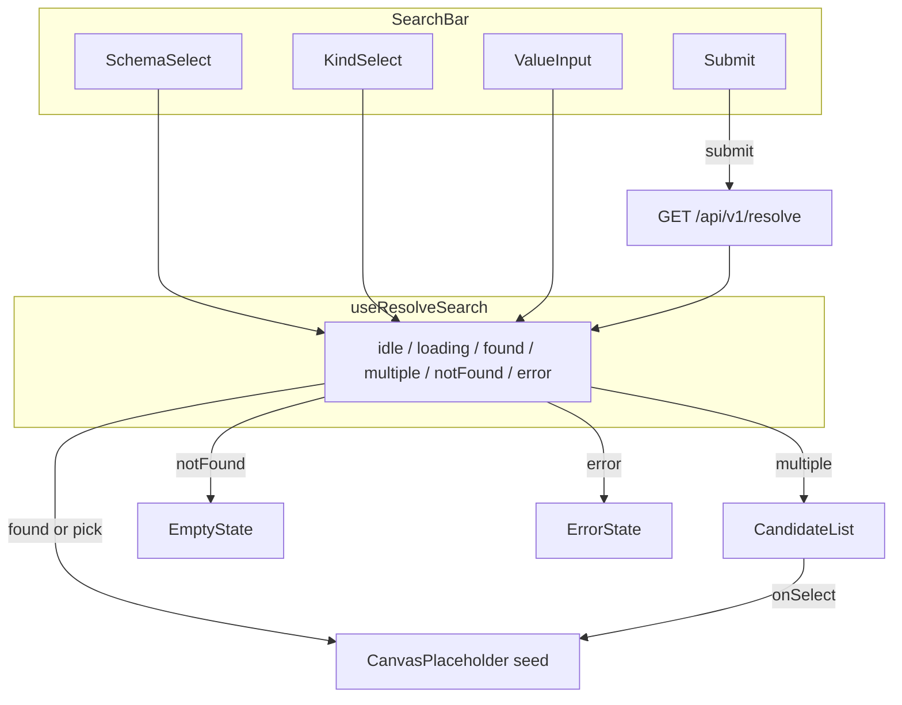

## Context

后端已具备 graph-api 能力：

- **GET `/api/v1/resolve?schema=&kind=&value=`** — 三态解析（`notFound` / `found` / `multiple`），返回 `{ type, id, title, subtitle }` 节点
- **GET `/api/v1/schemas`** — 返回实例上非系统 schema 名称列表（`string[]`）
- **POST `/api/v1/expand`** — 图展开（本 change **不消费**）

当前仓库无浏览器 UI；MCP 与 HTTP API 仅供程序化访问。本 change 在 `codegraph_web/` 新增 React SPA，作为用户探索代码图谱的**第一道门**：输入 commandId / flowId → 解析 → 把根节点作为 seed 交给画布占位区。图渲染与点击展开由后续 canvas change 接手。

约束：只读消费 REST；不直连 MySQL；kind 选项镜像 ENTRY_RESOLVERS（`commandId`、`flowId`）。

## Goals / Non-Goals

**Goals:**

- 持久三区域布局：搜索栏、主画布占位、状态区
- Schema 选择器（来自 `/api/v1/schemas`），未选 schema 禁止提交
- 搜索控件：kind + value，校验后调用 `/resolve`
- 三态 UI：found 落根、multiple 候选消歧、notFound 空状态
- 加载态（防重复提交）与错误态（可重试，区别于 notFound）
- 窄屏可用；Vitest + RTL 覆盖 tasks §6 场景
- 生产构建可由 FastAPI 同域挂载静态资源

**Non-Goals:**

- ER 图渲染、`/expand` 调用、节点详情面板
- 搜索历史、URL 深链、键盘快捷键
- 跨 kind 统一搜索、模糊匹配
- 新增后端 resolve/expand 逻辑

## Decisions

### 1. 目录与工具链

```
codegraph_web/
  package.json          # vite, react, typescript, vitest, @testing-library/react
  vite.config.ts        # dev proxy → localhost:8000
  src/
    main.tsx
    App.tsx             # 组合 Shell + 状态
    api/
      client.ts         # fetch wrapper, base URL
      schemas.ts        # listSchemas()
      resolve.ts        # resolveEntry()
    types/
      graph.ts          # GraphNode, ResolveResponse（镜像后端）
    components/
      AppShell.tsx      # 三区域布局 + 响应式
      SearchBar.tsx     # schema/kind/value + submit
      SchemaSelect.tsx
      KindSelect.tsx
      CanvasPlaceholder.tsx
      StatusPanel.tsx   # 路由到 empty / multiple / error / loading
      CandidateList.tsx
      EmptyState.tsx
      ErrorState.tsx
    hooks/
      useResolveSearch.ts   # 搜索状态机
    constants/
      entryKinds.ts     # ['commandId', 'flowId']
  src/**/*.test.tsx
```

**Rationale**: 独立 npm 包与 Python 后端并列，便于 `npm run dev` 与 `pytest` 分离；后续 canvas change 只替换 `CanvasPlaceholder` 实现。

### 2. 组件与数据流



- **AppShell**: CSS Grid/Flex — 顶栏固定、画布 `flex:1`、状态区在画布下方或侧栏（窄屏 stack 为顶栏 → 画布 → 状态区）。
- **CanvasPlaceholder**: prop `seed: GraphNode | null`；有 seed 时展示 type / id / title / subtitle 摘要卡片；无 seed 时 neutral 占位文案。
- **SearchBar**: 受控组件；`disabled` 当 schema 未选、value 空、或 `phase === 'loading'`。

### 3. 搜索状态机（`useResolveSearch`）

| phase | 触发 | UI | seed |
|-------|------|-----|------|
| `idle` | 初始 / 成功 found 后 | 无状态区内容或折叠 | 有则保留 |
| `loading` | 提交合法参数 | 加载指示；禁用提交 | 不变 |
| `found` | resolve status=found | 状态区 idle；seed=roots[0] | 更新 |
| `multiple` | resolve status=multiple | CandidateList | null 直至用户选择 |
| `notFound` | resolve status=notFound | EmptyState（非 error 样式） | null |
| `error` | fetch 失败或 HTTP 4xx/5xx | ErrorState + 重试 | 不变 |

**重试**: 保存最后一次合法 `{ schema, kind, value }`，重试按钮重新调用 `resolveEntry`。

**422**: 展示服务端 `detail` 为校验错误（就地提示，非 notFound）。

### 4. API 客户端

```typescript
// types/graph.ts — 与 schemas_resolve.GraphNodeOut / ResolveResponse 对齐
type GraphNode = { type: string; id: number; title?: string | null; subtitle?: string | null };
type ResolveResponse = {
  status: 'notFound' | 'found' | 'multiple';
  roots: GraphNode[];
  candidates: GraphNode[];
};

// api/resolve.ts
GET /api/v1/resolve?schema=&kind=&value=  // URLSearchParams 编码 value

// api/schemas.ts
GET /api/v1/schemas → string[]
```

- **base URL**: 生产 `''`（同域）；开发通过 Vite proxy `/api` → `http://127.0.0.1:8000`。
- **不引入** React Query/SWR — 单次 submit 状态机足够，避免过度抽象。

### 5. 开发与生产集成

| 环境 | 方式 |
|------|------|
| 本地 dev | `codegraph_web`: `npm run dev` (port 5173) + Vite proxy；另开 `python codegraph_server/app.py` |
| 生产 | `npm run build` → `codegraph_web/dist/`；FastAPI 挂载 `StaticFiles(directory=dist, html=True)` 于 `/`，API 仍在 `/api/v1/*` |

**CORS**: 生产同域挂载，无需 CORS。开发仅 Vite proxy，不在 FastAPI 加 CORSMiddleware（apply 时若需独立端口直连再加）。

`codegraph_server/app.py` 增加 SPA fallback：非 `/api` 路径返回 `index.html`（apply 任务）。

### 6. Kind 常量

```typescript
export const ENTRY_KINDS = [
  { value: 'commandId', label: 'Command ID' },
  { value: 'flowId', label: 'Flow ID' },
] as const;
```

与 `ENTRY_RESOLVERS` 保持同名；新增 resolver 时前后端各加一项（后续可改为 GET `/api/v1/resolve/kinds`）。

### 7. 样式与 a11y

- 纯 CSS Modules 或单文件 `app.css` — 不引入 UI 框架，控制依赖体积
- 表单控件带 `label` / `aria-busy`（loading）
- 候选列表用 `<button type="button">` 可键盘选择
- 窄屏：`min-width: 0` + `overflow-x: hidden` 防横向溢出

### 8. 测试策略

| 场景 | 手段 |
|------|------|
| found / multiple / notFound | mock `resolveEntry`，RTL 断言 DOM |
| error + retry | mock fetch reject / 500 |
| 未选 schema / 空 value | 断言未调用 API |
| loading 防重复 | 慢 mock + 双击 submit |
| 窄屏 | `@media` 或 `resize` + 断言三区域可见 |

API 层单测：`resolve.ts` / `schemas.ts` 参数拼接与 JSON 解析。

## Risks / Trade-offs

| 风险 | 缓解 |
|------|------|
| 前端 kind 与后端 ENTRY_RESOLVERS 漂移 | 常量集中 `entryKinds.ts`；测试断言选项集合；文档注明同步点 |
| `/schemas` 返回大量 DB 名 | v1 全量下拉；schema 多时再改 searchable select |
| multiple 候选达上限 50 | 列表全量渲染；可选 footnote「仅显示前 50 条」 |
| SPA 与 API 路由冲突 | StaticFiles 仅非 `/api`；API router prefix 保持 `/api/v1` |
| 无 Node CI | apply 时在 README 或 plan 注明 `npm test`；可选后续 CI job |

## Migration Plan

1. 脚手架 `codegraph_web/`（Vite react-ts 模板）
2. 实现 API 层 + `useResolveSearch` + 组件
3. 测试绿：`npm test`
4. FastAPI 挂载 `dist/`（可选：本 change 仅 dev 文档，挂载作为 tasks 最后一项）
5. 无数据迁移；回滚 = 不挂载 static / 不部署前端包

## Open Questions

1. **Static 挂载是否纳入本 change apply？** — 建议纳入（同域一键访问）；若 scope 紧可 defer 到 canvas change，本 change 仅保证 dev proxy 可用。
2. **Schema 下拉默认选中** — v1 不默认；用户显式选择（避免误查错误 schema）。
3. **i18n** — v1 中文或英文 UI  copy 二选一；建议英文控件 label + 中文空状态文案与 spec 一致即可。
