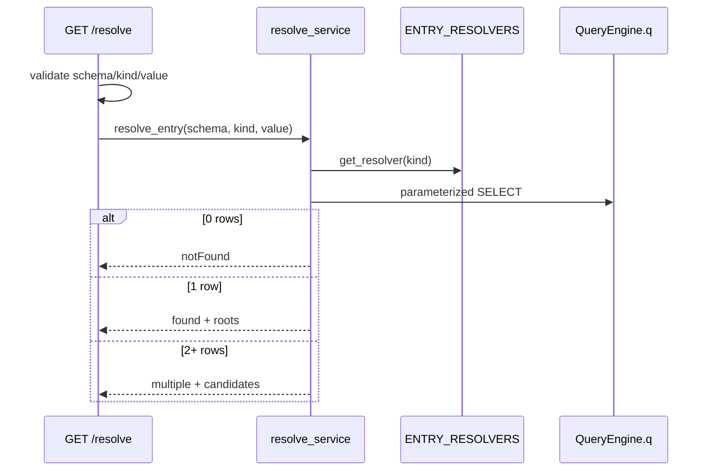

## Context

graph-core 提供 NodeSpec；graph-api 已提供 `POST /api/v1/expand` 从任意 `{ type, id }` 展开邻居。探索起点通常是外部标识（commandId、flowId），需 **resolve** 为根节点后再 expand。

现有 `routes.py` 有 `find_service_entry`、`get_flow` 等分散逻辑，无统一三态与 expand 兼容的节点形态。本 change 新增 ENTRY_RESOLVERS + GET resolve，与 EDGE_RULES / expand 对称。

## Goals / Non-Goals

**Goals:**

- ENTRY_RESOLVERS 注册表（commandId、flowId）
- `resolve_entry(schema, kind, value)` → `{ status, roots, candidates }`
- GET `/api/v1/resolve?schema=&kind=&value=`
- 三态：notFound / found / multiple
- 节点形态与 /expand 一致
- 参数化查询 + 查库前校验 + 测试覆盖 spec Scenario

**Non-Goals:**

- 更多 resolver 种类（bean、uri……）
- 跨 kind 统一搜索、模糊匹配
- MCP resolve tool
- 修改 MySQL schema

## Decisions

### 1. 包结构

```
codegraph_core/graph/
  entry_resolvers.py    # ENTRY_RESOLVERS + get_resolver(kind)
  resolve_service.py    # resolve_entry()
  shape.py              # shape_node(node_type, row) — shared with expand (optional refactor)
codegraph_server/
  routes.py             # GET /resolve
  schemas_resolve.py    # ResolveResponse Pydantic models
```

### 2. EntryResolver dataclass

```python
@dataclass(frozen=True)
class EntryResolver:
    kind: str
    node_type: str
    match_column: str
```

SQL 生成：

```python
spec = get_node_spec(resolver.node_type)
sql = (
    f"SELECT `{spec.id_column}`, `{spec.title}`, `{spec.subtitle}` "
    f"FROM `{spec.table}` WHERE `{resolver.match_column}` = %s "
    f"LIMIT %s"
)
```

### 3. 内置 resolver

| kind       | node_type       | match_column |
|------------|-----------------|--------------|
| commandId  | service_entry   | command_id   |
| flowId     | flow            | flow_id      |

加载时校验 `node_type in NODE_SPECS`。

### 4. 三态响应

```json
{
  "status": "found",
  "roots": [{ "type": "service_entry", "id": 12, "title": "...", "subtitle": "..." }],
  "candidates": []
}
```

| status     | roots      | candidates | HTTP |
|------------|------------|------------|------|
| notFound   | []         | []         | 200  |
| found      | [1 node]   | []         | 200  |
| multiple   | []         | [n nodes]  | 200  |

### 5. resolve_entry 流程



### 6. 与 expand 的节点契约

`shape_node(node_type, row)` 返回：

```python
{
    "type": node_type,
    "id": row[spec.id_column],
    "title": row.get(spec.title),
    "subtitle": row.get(spec.subtitle),
}
```

expand 的邻居整形应复用同一函数（apply 时小 refactor）。

### 7. 常量

```python
RESOLVE_MATCH_LIMIT = 50  # max rows for multiple disambiguation
```

### 8. 校验

| 输入 | 失败 |
|------|------|
| 非法 schema | 422 |
| 未知 kind | 422 |
| 空 value | 422 |

### 9. 测试

| 文件 | 覆盖 |
|------|------|
| `test_entry_resolvers.py` | 注册表、校验 |
| `test_resolve_service.py` | 三态、整形、注入 mock q |
| `test_resolve_route.py` | HTTP 422/200 |

## Risks / Trade-offs

[Risk] spec 写 nodeType `service_entries` 与 graph-core `service_entry` 不一致 → Mitigation: 实现用 graph-core 名；archive 前修正 delta/main spec。

[Risk] flowId 命中 flows 多行 vs 用户期望 service_entry 列表 → Mitigation: v1 按 spec 查 flows；文档说明；后续可加 kind。

[Risk] shape 逻辑与 expand_service 重复 → Mitigation: 抽取 `shape.py` 单测一次。

## Migration Plan

1. `entry_resolvers.py` + 测试
2. `resolve_service.py` + 测试（可选抽 shape）
3. GET route + HTTP 测试
4. 修正 spec nodeType 笔误
5. 无 DB migration

**Rollback**: 删除 resolver 模块与 route。

## Open Questions

1. multiple 超 RESOLVE_MATCH_LIMIT 时 status 仍为 multiple 但 candidates 截断，是否返回 `truncated: true`？→ v1 不返回，静默 LIMIT。
2. GET vs POST — 保持 GET 与 proposal 一致。
