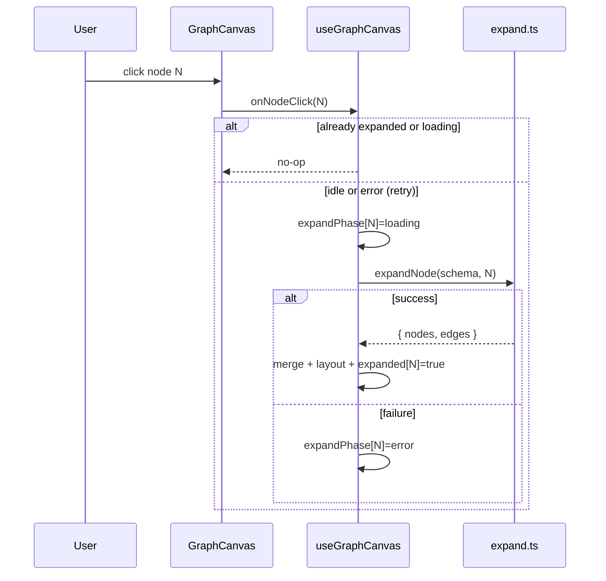

## Context

`browser-shell-and-search` 已交付搜索外壳：`useResolveSearch` 产出 **seed**（`GraphNode`），`CanvasPlaceholder` 仅占位展示。后端 **POST `/api/v1/expand`** 已实现（graph-api spec）：输入 `{ schema, node: { type, id }, edgeIds? }`，返回 `{ nodes, edges }`，边含 `ruleId`、`from`、`to`、`label`。

本 change 在 `codegraph_web/` 实现真正的**增量 ER 图画布**——browser-ui 中 deferred 的「图渲染与点击展开」。用户从 seed 出发，逐层点击节点长大图；同一 `(type,id)` 与边不重复；每节点独立 loading/error。

**当前缺口**：
- `SearchBar` 的 `schema` 为组件内 state，expand 需要同一 schema → apply 时提升到 `App`
- `CanvasPlaceholder` 需替换为 `GraphCanvas`

## Goals / Non-Goals

**Goals:**

- 接收 seed → 初始单节点图（无边）
- React Flow 渲染节点（title/subtitle、type 可区分）与边
- 点击节点 → `/expand` → 去重 merge → 增量布局
- Per-node：loading / error+retry / expanded 标记
- 加载中禁止同节点重复 expand；其它节点仍可点
- Vitest + RTL 覆盖 tasks §6

**Non-Goals:**

- 节点详情面板、折叠子树、图内搜索、边类型筛选 UI
- 传 `edgeIds`（v1 默认全 forward 边）
- 已展开节点再次点击重新 expand
- 撤销/重做、导出、URL 深链、力导向调参

## Decisions

### 1. 依赖

```bash
npm install @xyflow/react @dagrejs/dagre
npm install -D @types/dagre   # 若需要
```

- **@xyflow/react**: 画布、缩放平移、自定义 node/edge
- **@dagrejs/dagre**: 分层布局（默认 `rankdir: 'LR'`）

### 2. 目录结构

```
codegraph_web/src/
  api/
    expand.ts              # expandNode(schema, node) → ExpandResponse
    expand.test.ts
  types/
    graph.ts               # 扩展 GraphEdge, ExpandResponse
  graph/
    keys.ts                # nodeKey(), edgeKey()
    graphStore.ts          # 纯函数: createFromSeed, mergeExpandResult
    layout.ts              # layoutIncremental(existing, newNodes, anchorId)
    useGraphCanvas.ts      # seed/schema → React Flow nodes/edges + handlers
  components/
    GraphCanvas.tsx        # ReactFlow 容器
    CodegraphNode.tsx      # 自定义 node type
    graphCanvas.css
  constants/
    nodeTypeColors.ts      # 14 type → border/color
```

`CanvasPlaceholder.tsx` 保留但不再被 `App` 引用（或删除并在测试中迁移）。

### 3. 类型（镜像后端）

```typescript
type NodeRef = { type: string; id: number };

type GraphEdge = {
  ruleId: string;
  from: NodeRef;
  to: NodeRef;
  label: string;
};

type ExpandResponse = {
  nodes: GraphNode[];
  edges: GraphEdge[];
};
```

### 4. 去重键

```typescript
export function nodeKey(n: NodeRef): string {
  return `${n.type}:${n.id}`;
}

export function edgeKey(e: GraphEdge): string {
  return `${e.ruleId}:${e.from.type}:${e.from.id}:${e.to.type}:${e.to.id}`;
}
```

`mergeExpandResult(state, response)`：
- 跳过已存在 nodeKey / edgeKey
- 更新已有节点的 title/subtitle（若 expand 返回更完整信息）
- 返回 `{ addedNodes, addedEdges }` 供布局使用

### 5. 图状态模型

```typescript
type GraphState = {
  nodes: Map<string, GraphNode & { expanded?: boolean }>;
  edges: Map<string, GraphEdge>;
  positions: Map<string, { x: number; y: number }>;
  expandPhase: Map<string, 'idle' | 'loading' | 'error'>;
};
```

- **Seed 变更**（`useEffect` on `seed` + `schema`）：`resetGraph(seed)` → 单节点居中 `(0,0)` 或视口中心
- **Expand 成功**：merge + `expanded=true` on source + clear phase
- **Expand 失败**：source phase=`error`，图结构不变

### 6. Expand 交互（`useGraphCanvas`）



- **Retry**：错误节点上的按钮或再次点击（v1：错误态显示 Retry 按钮，不依赖再次 click）
- **并发**：不同节点可同时 loading（Map 按 key）；规范要求「其它节点可交互」→ 允许 B 在 A loading 时 expand

### 7. React Flow 映射

| 内部 | React Flow |
|------|------------|
| `nodeKey` | `node.id`（string） |
| position | `node.position` |
| type 区分 | `type: 'codegraph'` + `data.nodeType` |
| 边 | `id: edgeKey`, `source/target: nodeKey`, `label: edge.label` |

`CodegraphNode` 展示：
- title（主）、subtitle（次）
- type badge + `node-type--${type}` 边框色
- expanded：checkmark 或 dimmed border
- loading：spinner overlay（`data-testid="node-loading"`)
- error：红色描边 + Retry（`data-testid="node-error"`）

### 8. 增量布局（`layout.ts`）

**策略（v1 实用版）**：

1. 已有节点：**保留** `positions` 中坐标
2. 新增节点：以被展开节点 `anchor` 为参考，用 **局部 dagre**：
   - 子图 = anchor + 新增节点 + 连接它们的边
   - dagre 布局子图，平移使 anchor 位置不变
   - 仅写入**新** nodeKey 的 position
3. 若新节点与已有重叠（距离 < threshold），微移新节点

**稳定性测试**：merge 前后 snapshot 已有节点 coordinates，断言 max delta ≤ 1px（layout 函数 unit test mock）。

全图 dagre 重排 **不做**（避免整图跳）。

### 9. App 集成

```typescript
// App.tsx
const [schema, setSchema] = useState('');

<SearchBar
  schemas={schemas}
  schema={schema}
  onSchemaChange={setSchema}
  ...
/>
<GraphCanvas schema={schema} seed={seed} />
```

`SearchBar` 改为受控 schema（或 `onSubmit` 带出 schema 已由父级持有）。

`seed === null` → `GraphCanvas` 显示空画布提示（等同原 canvas-empty）。

### 10. 测试策略

| 场景 | 方法 |
|------|------|
| seed → 单节点 | render GraphCanvas, count `.react-flow__node` |
| click → expand | mock `expandNode`, fire node click |
| dedupe | merge unit tests in `graphStore.test.ts` |
| per-node loading | mock slow expand, assert `node-loading` on one node only |
| layout stable | `layout.test.ts` coordinates before/after |

React Flow 在 jsdom：使用 `@xyflow/react` 测试模式或 mock `GraphCanvas` 内核 hook。

## Risks / Trade-offs

| 风险 | 缓解 |
|------|------|
| dagre 局部布局仍可能轻微移动邻居 | v1 接受；测试「anchor 不动 + 新节点 near anchor」 |
| React Flow 在 jsdom 体积/渲染 | hook/store 单测为主；少量 integration 测 click |
| 大图性能（数百节点） | v1 不优化；后续虚拟化/viewport culling |
| schema 未选时 seed 已落 | disable expand 或 SearchBar 已阻止无 schema 搜索 |
| 14 type 颜色相近 | `nodeTypeColors` 固定调色板，测试抽样两种 type class 不同 |

## Migration Plan

1. 安装依赖 + `expand.ts`
2. `graphStore` + keys + layout 纯函数 + 单测
3. `CodegraphNode` + `GraphCanvas` + CSS
4. 提升 schema、`App` 接线，移除 `CanvasPlaceholder` 引用
5. `npm test` + 手动 dev 连真实 API
6. 无后端变更；回滚 = 恢复 `CanvasPlaceholder`

## Open Questions

1. **删除 CanvasPlaceholder？** — apply 时删除或保留未引用；倾向删除减少 dead code。
2. **错误 Retry UX** — 节点内小按钮 vs 再次点击；spec 要求「提供重试」→ 显式 Retry 按钮。
3. **graph-browser vs browser-ui 主 spec** — archive 时 merge 到 `openspec/specs/graph-browser/spec.md` 或扩展现有 `browser-ui`；按 delta 目录 `graph-browser` 新建主 spec。
